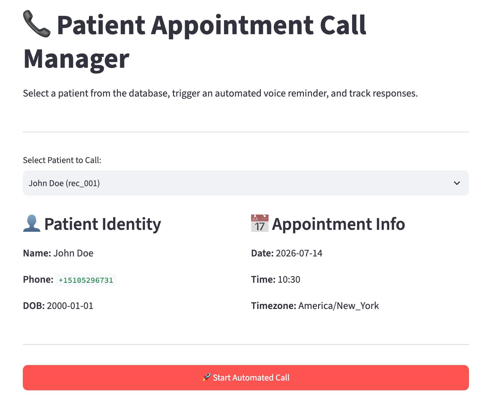

# AI Appointment Reminder System

## Overview

This project is a prototype AI appointment reminder system that connects stored patient records to automated phone calls.

The goal was to build the workflow behind an AI calling system:

1. Select a patient record
2. Retrieve appointment information from a database
3. Generate a personalized reminder
4. Trigger an outbound AI phone call
5. Store the call outcome

The application provides a Streamlit interface where an operator can select a patient, start a call, and view previous call attempts.

This project uses synthetic patient records for demonstration purposes.

---

## Live Demo

Try the deployed Streamlit application:

https://vapi-appointment-reminders.streamlit.app



---

## Tech Stack

* **Python** for application logic and API integration
* **Streamlit** for the operator interface
* **SQLite3** for patient records and call history
* **Vapi API** for outbound AI phone calls
* **OpenAI GPT-4o-mini** for conversation handling
* **Deepgram Nova-3** for speech transcription

---

## Architecture
mermaid
flowchart TD
    A[Patient Database] --> B[Streamlit App]
    B --> C[Vapi API]
    C --> D[AI Phone Call]
    D --> E[Process Response]
    E --> F[Call Attempts Database]## Workflow

### 1. Select Patient

The operator selects a patient from the Streamlit interface.

The application retrieves:

* Patient name
* Phone number
* Appointment date
* Appointment time
* Timezone

### 2. Generate Reminder

The system creates a personalized reminder message using stored appointment information.

Example:

```
Hello John, this is an automated reminder for your appointment on Tuesday, July 14th at 10:30 AM.

Say 1 to confirm, or say 2 to reschedule.
```

### 3. Place AI Call

The application sends the patient information and assistant instructions to Vapi.

The AI assistant handles the conversation and collects the patient's response.

### 4. Store Outcome

After the call completes, the response is classified and stored.

Possible outcomes:

* `CONFIRMED`
* `RESCHEDULE`
* `NO_INPUT`
* `INVALID`

---

## Database Design

The project uses a two-table SQLite database.

### Patients Table

Stores patient information needed to make calls.

Example fields:

* `patient_id`
* `first_name`
* `last_name`
* `phone_number`
* `appointment_date`
* `appointment_time`
* `timezone`

This table answers:

> Who should be called?

---

### Call Attempts Table

Stores each individual call interaction.

Example fields:

* `call_attempt_id`
* `patient_id`
* `vapi_call_id`
* `status`
* `decision`
* `user_speech`
* `created_at`

This table answers:

> What happened when we attempted to call?

Separating these tables allows one patient to have multiple call attempts without overwriting previous history.

Example:

```
Patient:
John Smith

Call History:
- Reminder call → CONFIRMED
- Follow-up call → NO_INPUT
- Retry call → CONFIRMED
```

---

## Features

* Streamlit operator dashboard
* Patient selection from SQLite database
* Dynamic appointment reminders
* AI outbound phone calls through Vapi
* Speech transcription through Deepgram
* Patient response classification
* Call history tracking

---

## Running the Project

### Requirements

* Python 3.10+
* Vapi API credentials
* Streamlit

### Installation

Clone the repository:

```bash
git clone https://github.com/aksharabharath/vapi-appointment-reminders.git

cd vapi-appointment-reminders
```

Install dependencies:

```bash
pip install -r requirements.txt
```

Configure API credentials:

```bash
VAPI_API_KEY=your_api_key
VAPI_PHONE_NUMBER_ID=your_phone_number_id
```

Run the application:

```bash
streamlit run app.py
```

---

## Future Improvements

Possible next steps:

* Replace polling with webhook-based call updates
* Add retry logic for failed calls
* Add SMS fallback through services like Twilio when calls fail or patients are unreachable
* Add operator authentication
* Improve monitoring and error tracking
* Add analytics for call outcomes
* Connect with real healthcare scheduling systems
